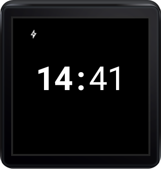
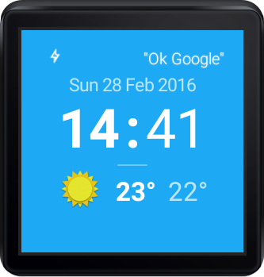
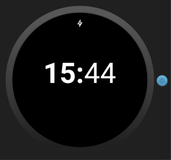
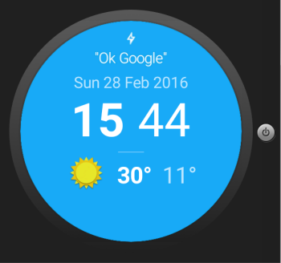

adn6--sunshine-wear

# AD nanodegree - Project 6: Go Ubiquitous

by CChevalier, Feb. 2016

## Introduction
This README file presents the references I used to complete the Android Developer Nanodegree - Project 6: Go Ubiquitous

- Original code for the Sunshine app taken from [branch 7.05](https://github.com/udacity/Advanced_Android_Development/tree/7.05_Pretty_Wallpaper_Time) of the Udacity [repository](https://github.com/udacity/Advanced_Android_Development)
- [Original README.md](./README_Original.md)

### Snapshots

.  .

.  .


  
## Main References Used

#### Android Developers  
- [Creating Watch Faces](http://developer.android.com/training/wearables/watch-faces/index.html)  
- [Sending and Syncing Data](http://developer.android.com/training/wearables/data-layer/index.html)  
- [Set up an Android Wear Emulator / Connecting phone to watch emulator] (https://developer.android.com/training/wearables/apps/creating.html#SetupEmulator)
    Forward the AVD's communication port to the connected handheld device (must do this every time the handheld is connected):  
    ``` C:\Users\cch\AppData\Local\Android\sdk\platform-tools\adb -d forward tcp:5601 tcp:5601 ```

#### On the Discussion Forum
- Using the Wear Data API: [app / wearable common requirements](https://discussions.udacity.com/t/using-the-wear-data-api/27400/2) and [setUrgent()](https://discussions.udacity.com/t/using-the-wear-data-api/27400/17)
  
  
  


## Some Additional References  
#### Misc.  
- [Code.tutsplus.com - Creating an Android Wear Watch Face](http://code.tutsplus.com/tutorials/creating-an-android-wear-watch-face--cms-23718)
  
#### SWARM Tutorial: Building an Android Wear Watch Face 
- [Part 1 - Overview](http://swarmnyc.com/whiteboard/how-to-design-and-develop-an-android-watch-face-app-wearables-overview/)
- [Part 2 - Interface](http://swarmnyc.com/whiteboard/building-android-wear-watch-face-the-watch-interface/)
- [Part 3 - Weather Info](http://swarmnyc.com/whiteboard/building-android-wear-watch-face-with-live-weather-data-3/)
- [Code on GitHub](https://github.com/swarmnyc/WatchFaces)